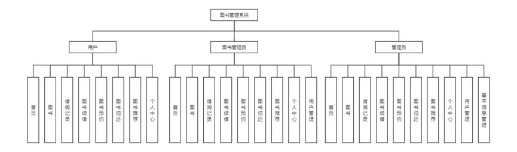
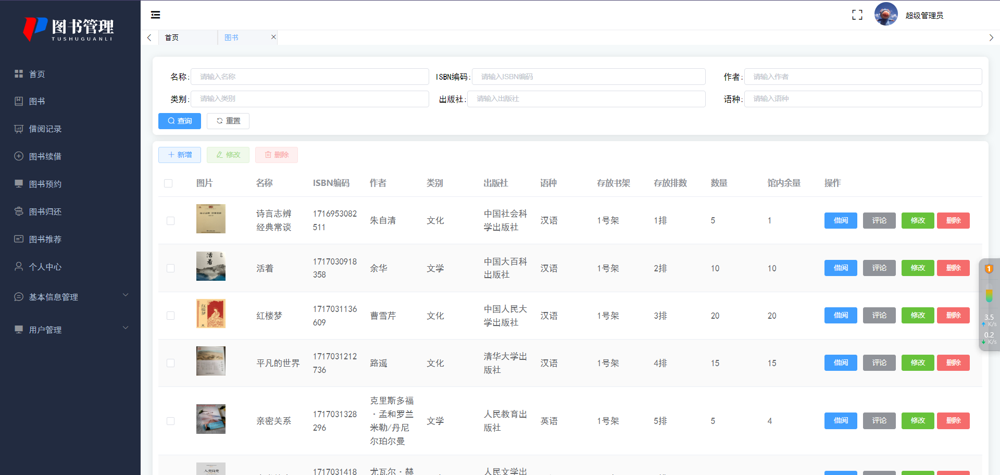
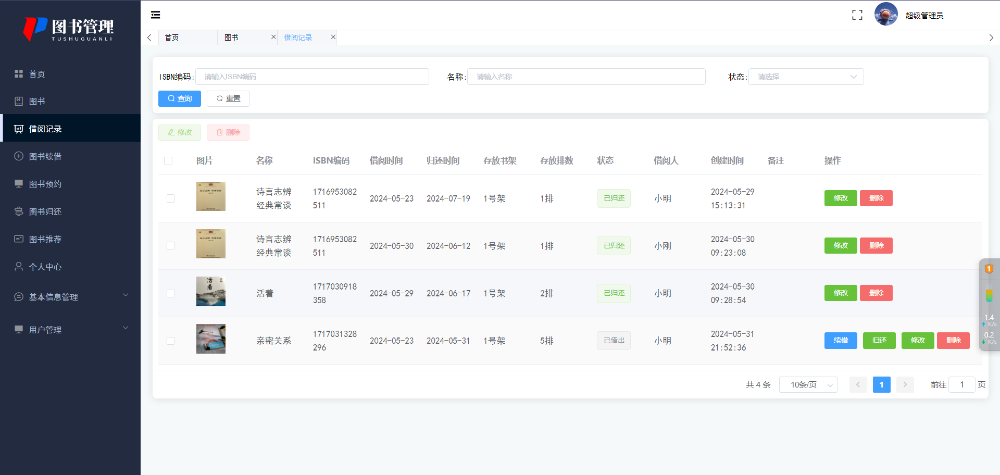
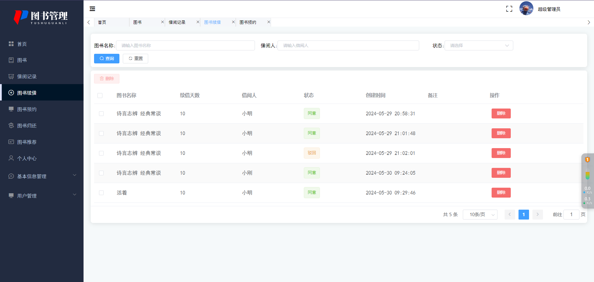
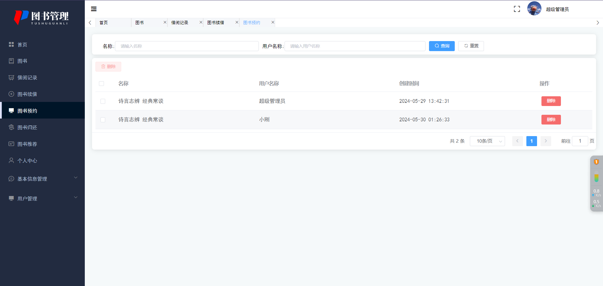
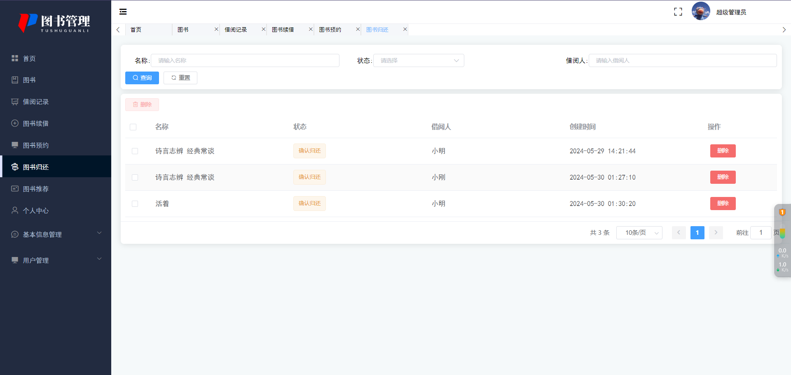
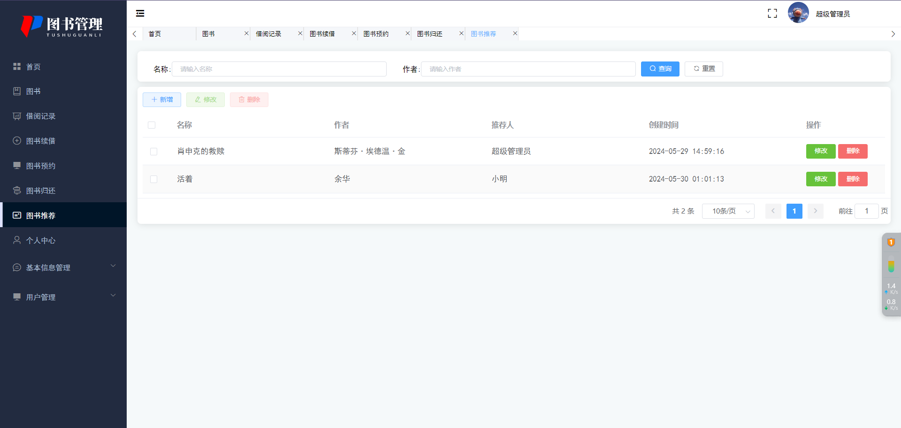
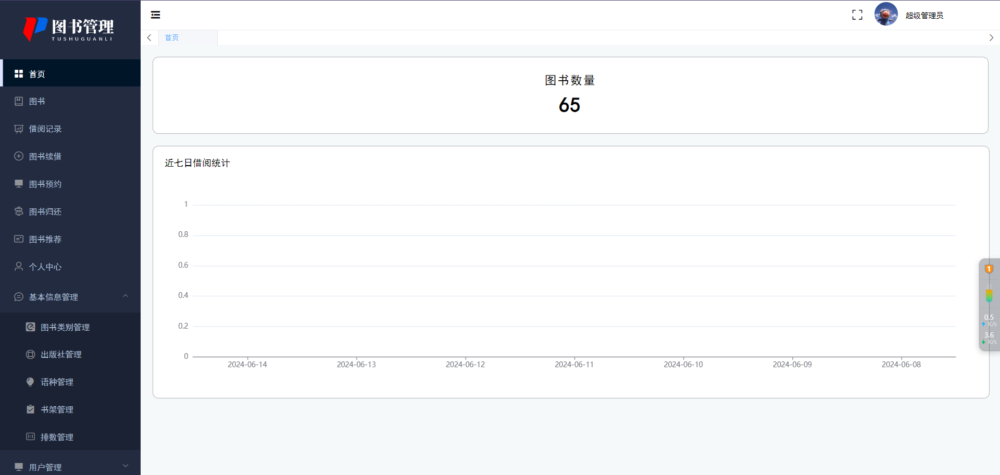
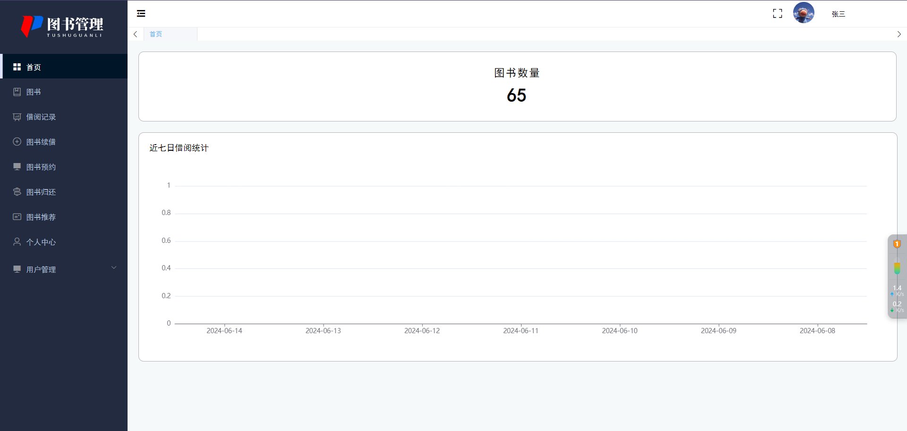
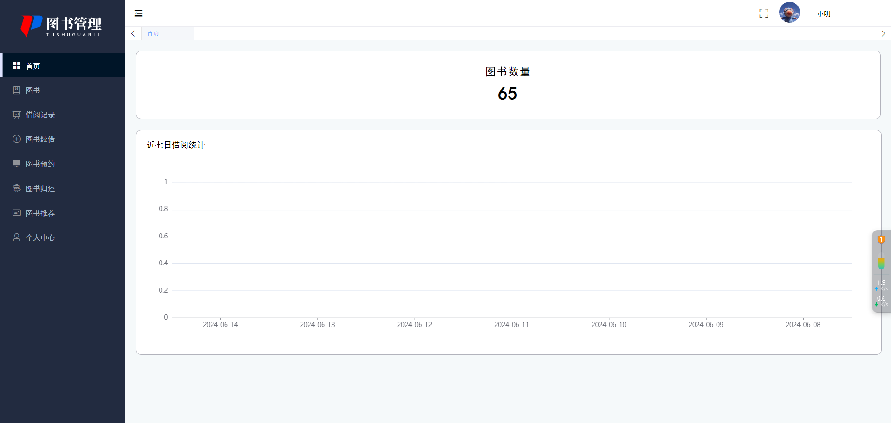

# SpringBoot+Vue的图书管理系统

**有问题可以咨询企鹅Q1760272627** 

### 功能：
用户：首页、图书、借阅图书、借阅记录、图书续借、图书预约、图书归还、图书推荐、个人中心。

图书管理员：首页、图书管理、借阅记录、审核借阅、图书续借、审核续借、确认归还、查看推荐、个人中心、用户管理。

管理员：首页、图书管理、借阅记录、审核借阅、图书续借、审核续借、确认归还、查看推荐、个人中心、用户管理、图书管理员管理、管理员管理、图书类别管理、出版社管理、语种管理、书架管理、排数管理。

### 采用技术：
SpringBoot，shiro，Mybatis-plus，Vue，redis，mysql，ElementUi，echarts

### 工具：
idea，vscode，navicat

###  功能结构：

### 系统截图：

图书：

管理员页面：

图书管理员界面：

用户：
